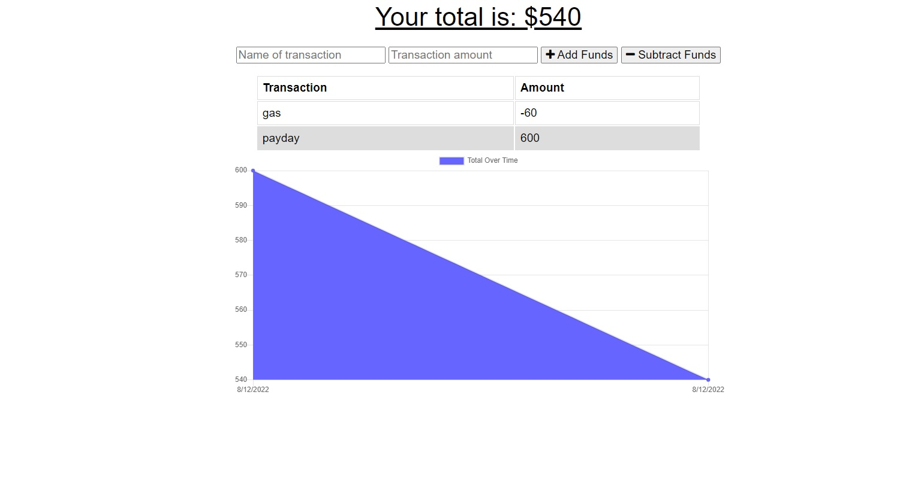

  # Best Budget

  

  ## Description

  This is a budget tracking app that was built using node.js and express as well as mongoDB. It has full PWA capabilities and utilized indexDB to achieve this.

  ## Table of Contents
  * [Installation](#installation)
  * [Usage](#usage)
  * [License](#license)
  * [Contribution](#contribution)
  * [Tests](#tests)
  * [Questions](#questions)
  * [Links](#links)
  * [Screenshot](#screenshot)
  
  ## Installation

  Navigate to link below and install from the address bar.

  ## Usage

  You can use this App either from the link below OR you can download it and use it from your desktop!

  ## License

  This project uses the The MIT License.  
  Please visit [https://opensource.org/licenses/MIT](https://opensource.org/licenses/MIT) to learn more.
  

  ## Contribution

  Some code was provided by the instructor of the class, Gary Talmes.
  
  ## Tests 

  To see how the PWA functionality works you can head to the site from the link and open your dev tool on chrome to shut off your network. After that try making some transactions!
  
  ## Questions
  Questions? Comments? Concerns? Feel free to reach out!  
  Email: bmkersey@gmail.com  
  GitHub: [bmkersey](https://github.com/bmkersey)  
  
  ## Links
  [Click here to visit Best Budget](https://radiant-sierra-73547.herokuapp.com/)

  ## Screenshot
  
  